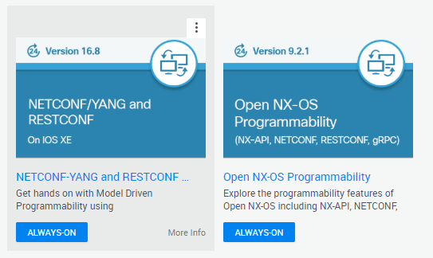

# Hands-on NETCONF
A brief introduction to NETCONF, outlined in [RFC 6241](https://datatracker.ietf.org/doc/rfc6241/). 

Juniper provides a [free vLab environment](https://jlabs.juniper.net/vlabs/portal/index.page).

Cisco provides a free lab environment at [DevNet](https://developer.cisco.com/site/sandbox/).

On Cisco's DevNet, I recommend the always-on "NETCONF/YANG and RESTCONF on IOS XE" sandbox and the "Open NX-OS Programmability" sandbox.  

